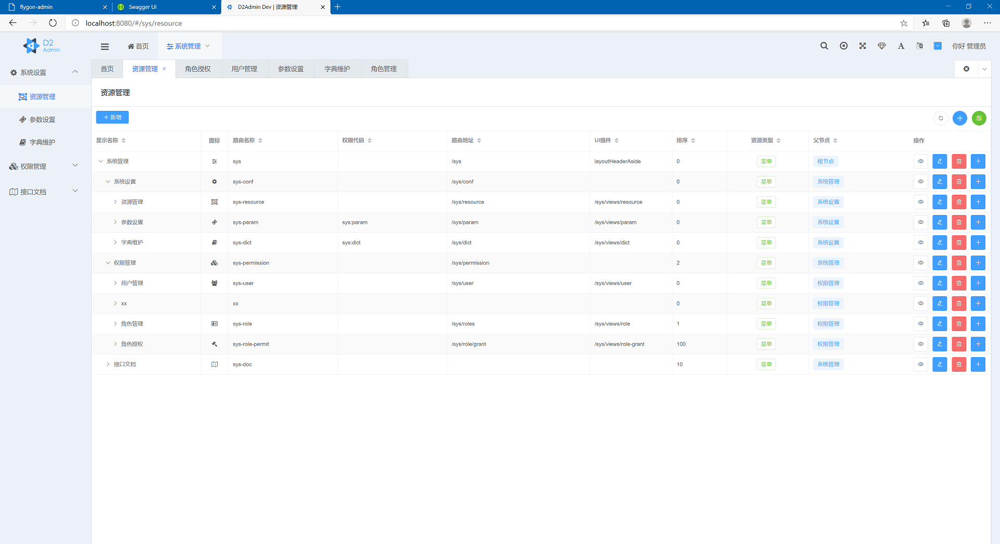
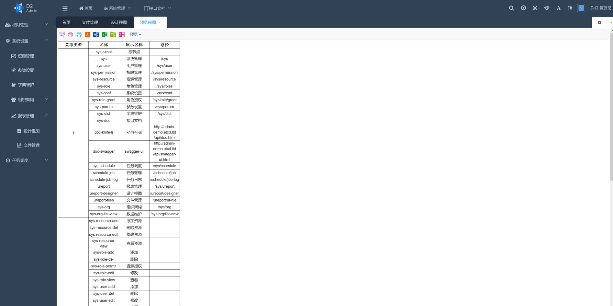
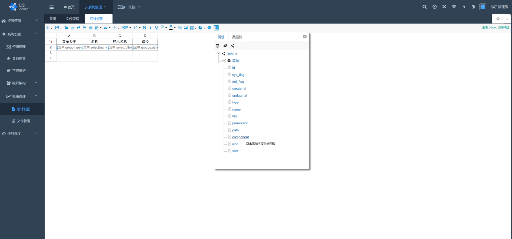
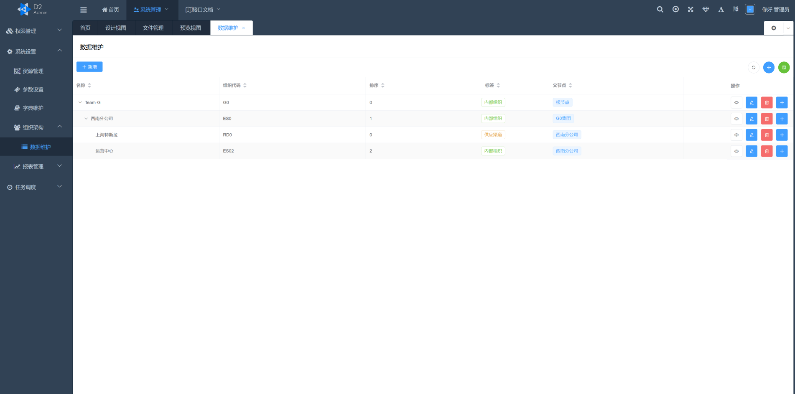
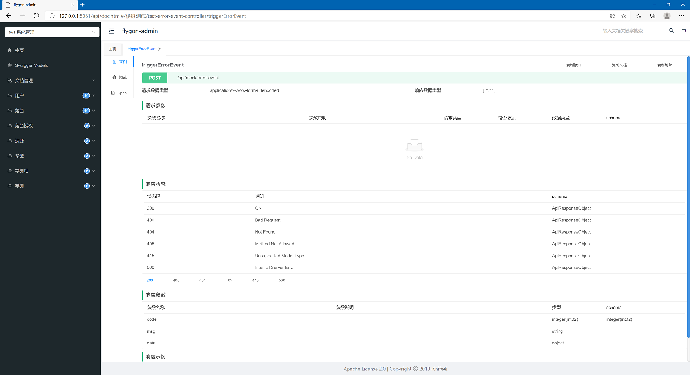
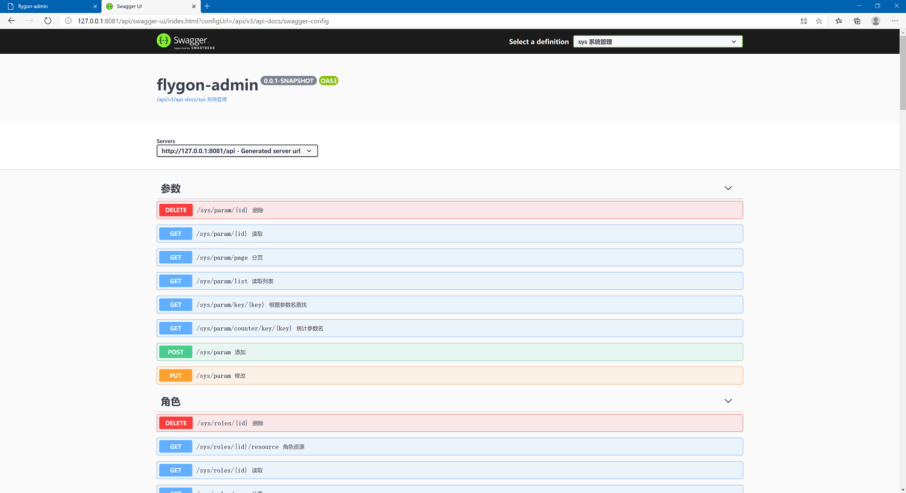
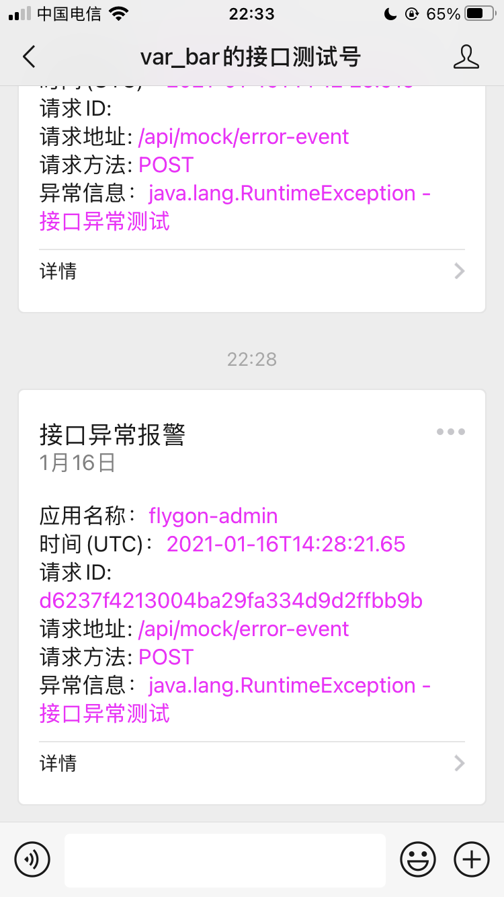
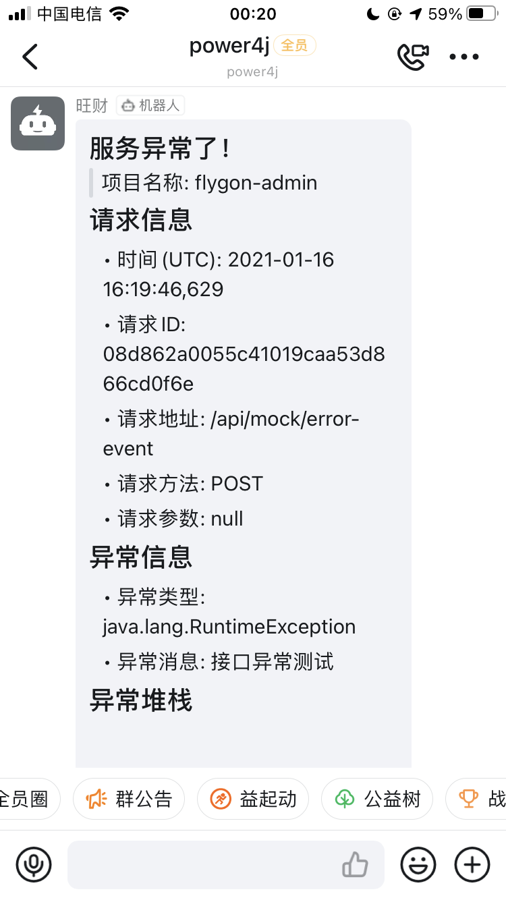

# JI-ADMIN-UI

这是一个后台管理系统系统的UI部分，此项目基于[d2-crud-plus-with-d2admin-starter](https://github.com/greper/d2-crud-plus-with-d2admin-starter) ，做这个本来是想了解一下D2，也踩了一些坑，所以分享一下，我特意保留了原项目的全部提交记录，方便大家参考。

本项目实现了一个权限管理系统的最基础部分，适合开发中小型项目，由于功能简洁，可以很容易地进行定制， 变成你自己的`starter`脚手架。

后端项目: https://github.com/power4j/ji-boot

## 功能

目前实现的功能有

- [x] API文档：可同时使用`swagger`和`knife4j`
- [x] 资源管理：负责管理UI资源，如菜单、按钮
- [x] 权限管理：用户、角色、资源授权、角色授权
- [x] 公共参数、数据字典
- [x] 常量字典: 消除硬编码,前后端统一维护字典数据
- [x] 服务异常报警: 微信、钉钉
- [x] 任务调度
- [x] 访问日志

> 体验地址 http://ji-boot-demo.etcd.ltd/
>
>用户名/密码: `admin/admin`
>
> 如需本地部署体验，请使用`ji-boot-docker`项目

### 界面截图

## Special Thanks

- [JetBrains Developer Toolbox](https://www.jetbrains.com/?from=sequence)
- [D2 Projects](https://github.com/d2-projects)

## 联系方式

